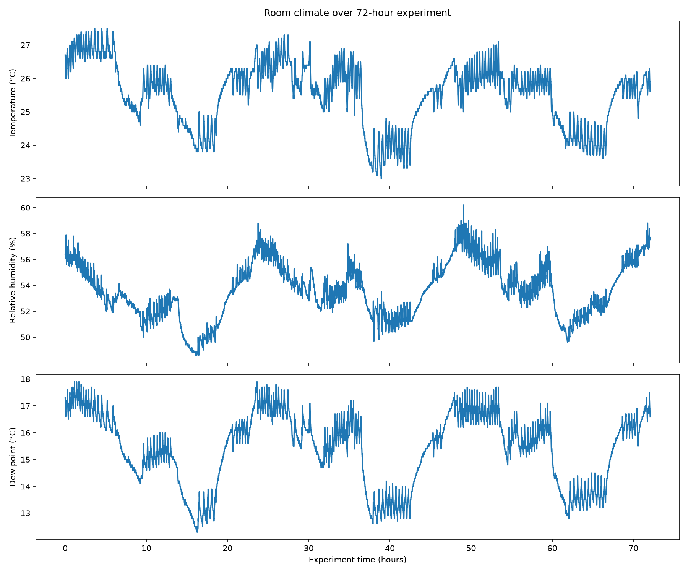

# Room climate observations

The 72-hour dataset shows a repeating day and night pattern.

Temperature drops during each night and rises again during the day.

Relative humidity follows a similar overall pattern.

Dew point also follows the same larger pattern.

There are also smaller repeated rises and drops throughout the dataset. These were examined further in [Temperature cycle detection](temperature-cycle-detection.md).

